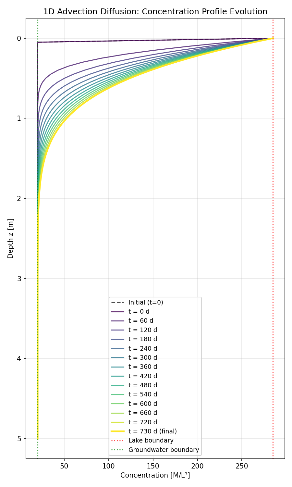

# Example: Lake-Sediment Interface Problem

This example demonstrates a complete workflow for solving a 1D advection-diffusion problem in a vertical soil column beneath a lake.

## Problem Setup

We simulate solute transport in a 5-meter vertical column of soil with the following conditions:

- **Physical domain**: 5 m column with 60% porosity
- **Hydraulic conditions**: Upward flow with 0.2 m head difference
- **Transport**: Molecular diffusion and mechanical dispersion
- **Boundary conditions**: High concentration in lake (285), low in groundwater (20)
- **Initial condition**: Uniform concentration equal to groundwater (20)
- **Simulation**: 2 years (730 days) with snapshots every 60 days

## Complete Code Example

The following is the complete `main.py` script:

```python
"""
Main script to run the 1D advection-diffusion solver.

Test case: Vertical soil column under a lake with upward groundwater flow.
"""

import numpy as np
from solve import solve


def main():
    """Run the test case."""
    
    # Define input parameters
    params = {
        # Physical domain
        'L': 5.0,              # Column length [m]
        'porosity': 0.6,       # Porosity [dimensionless]
        
        # Hydraulic parameters
        'K': 0.01,             # Hydraulic conductivity [m/d]
        'delta_h': 0.2,        # Head difference [m] (positive for upward flow)
        
        # Transport parameters
        'D_m': 0.000175,       # Molecular diffusion coefficient [m²/d]
        'alpha_L': 0.5,        # Longitudinal dispersivity [m]
        
        # Boundary conditions
        'C_lake': 285.0,       # Lake concentration at top [M/L³]
        'C_gw': 20.0,          # Groundwater concentration at bottom [M/L³]
        
        # Initial condition
        'C_init': 20.0,        # Initial concentration (constant, same as C_gw) [M/L³]
        
        # Numerical parameters
        'N': 100,              # Number of grid points
        'delta_t': 1.0,        # Time step [d]
        't_max': 730.0,        # Maximum time [d] (2 years)
        
        # Options
        'save_history': False,      # Save full time history (set to True to save all time steps)
        'output_interval': 60.0,    # Save snapshot every N days (None to disable)
    }
    
    # Run solver with Crank-Nicolson method (recommended)
    result = solve(params, method='crank_nicolson', verbose=True)
    
    # Extract results
    C = result['C']
    z = result['z']
    t = result['t']
    params = result['params']
    
    # Get snapshots if available
    C_snapshots = result.get('C_snapshots', None)
    t_snapshots = result.get('t_snapshots', None)
    
    # Print summary
    print("\n" + "="*60)
    print("SOLUTION SUMMARY")
    print("="*60)
    print(f"Final time: {t[-1]:.2f} days")
    print(f"Concentration at top (z=0):     {C[0]:.2f}")
    print(f"Concentration at bottom (z=L): {C[-1]:.2f}")
    print(f"Concentration at midpoint:     {C[len(C)//2]:.2f}")
    print(f"\nDerived parameters:")
    print(f"  Darcy velocity (q):           {params['q']:.6f} m/d")
    print(f"  Pore water velocity (v):      {params['v']:.6f} m/d")
    print(f"  Effective dispersion (D_eff): {params['D_eff']:.6f} m²/d")
    print(f"  Péclet number (global):      {params['Pe_global']:.4f}")
    if C_snapshots is not None:
        print(f"\nSnapshots saved at {len(t_snapshots)} time points")
    print("="*60)
    
    # Optional: Plot results (uncomment if matplotlib is available)
    try:
        import matplotlib.pyplot as plt
        
        plt.figure(figsize=(8, 10))
        
        # Get initial condition
        from solve import initialize_concentration
        C_init = initialize_concentration(params)
        
        # Plot initial condition
        plt.plot(C_init, z, 'k--', linewidth=1.5, alpha=0.7, label='Initial (t=0)')
        
        # Plot snapshots if available
        if C_snapshots is not None and len(C_snapshots) > 0:
            # Use a colormap for different times
            colors = plt.cm.viridis(np.linspace(0, 1, len(C_snapshots)))
            
            for i, (C_snap, t_snap) in enumerate(zip(C_snapshots, t_snapshots)):
                if i == len(C_snapshots) - 1:
                    # Final state - make it more prominent
                    plt.plot(C_snap, z, color=colors[i], linewidth=2.5, 
                            label=f't = {t_snap:.0f} d (final)')
                else:
                    plt.plot(C_snap, z, color=colors[i], linewidth=1.5, 
                            alpha=0.8, label=f't = {t_snap:.0f} d')
        else:
            # If no snapshots, just plot final state
            plt.plot(C, z, 'b-', linewidth=2, label=f'Final (t={t[-1]:.0f} d)')
        
        # Plot boundary concentrations
        plt.axvline(x=params['C_lake'], color='r', linestyle=':', 
                   linewidth=1.5, alpha=0.7, label='Lake boundary')
        plt.axvline(x=params['C_gw'], color='g', linestyle=':', 
                   linewidth=1.5, alpha=0.7, label='Groundwater boundary')
        
        plt.xlabel('Concentration [M/L³]')
        plt.ylabel('Depth z [m]')
        plt.title('1D Advection-Diffusion: Concentration Profile Evolution')
        plt.legend(loc='best', fontsize=9)
        plt.grid(True, alpha=0.3)
        plt.gca().invert_yaxis()  # Invert so z=0 is at top
        plt.tight_layout()
        plt.savefig('concentration_profile.png', dpi=150)
        plt.show()
        print("\nPlot saved to 'concentration_profile.png'")
    except ImportError:
        print("\nMatplotlib not available. Skipping plot.")
    
    return result


if __name__ == '__main__':
    result = main()
```

## Running the Example

To run this example:

```bash
python main.py
```

## Results

The solver produces the following output:

1. **Console output**: Progress information, stability checks, and a summary of results
2. **Plot**: Visualization of the concentration profile evolution over time
3. **Results dictionary**: Contains all solution data for further analysis

### Expected Output

The solver will print:
- Solution progress and Péclet numbers
- Final concentration values at key locations
- Derived parameters (velocities, dispersion coefficients)
- Number of snapshots saved

### Visualization

The generated plot shows:

{width=800px}

**Plot features:**
- **Initial condition** (black dashed line): Uniform concentration at groundwater level
- **Time snapshots** (colored lines): Concentration profiles at 60-day intervals
- **Final state** (thick colored line): Concentration profile after 730 days
- **Boundary markers**: Vertical lines showing lake and groundwater concentrations

The plot demonstrates how the concentration profile evolves from the initial uniform state toward a steady-state distribution, with the high-concentration lake water diffusing downward while being counteracted by upward advection from the groundwater.

## Interpretation

This example illustrates the competition between:

1. **Downward diffusion**: High-concentration lake water (285) diffuses into the column
2. **Upward advection**: Low-concentration groundwater (20) flows upward

The final profile represents a balance between these two processes. The Péclet number indicates the relative importance of advection versus diffusion:
- **High Péclet number**: Advection dominates, creating a steep concentration gradient near the top
- **Low Péclet number**: Diffusion dominates, creating a more gradual transition

In this example, the global Péclet number is approximately 0.57, indicating that diffusion and advection are both significant contributors to the transport process.

